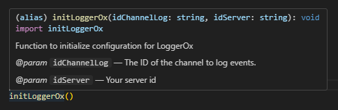

<br>
<div align="center">
  
  <h3 align="center">LoggerOx</h3>
  <p align="center">You are currently reading the repository documentation, happy reading :)</p>
</div>
<br>

# LoggerOx Repository
LoggerOx is a package for logging your Discord server via your Discord bot. Easy and quick to use!

<br>

# Lists of events:
```
- getChannelCreate, 
- getChannelDelete, 
- getPinsUpdate, 
- getChannelUpdate,
- getDebug, 
- getEmojiCreate, 
- getEmojiDelete, 
- getEmojiUpdate, 
- getBanAdd, 
- getBanRemove, 
- getScheduledCreate, 
- getScheduledDelete, 
- getScheduledUpdate, 
- getScheduledUserAdd, 
- getGuildUpdate, 
- getGuildMemberUpdate, 
- getGuildUnavailable, 
- getGuildMemberAdd, 
- getGuildMemberRemove, 
- getScheduledUserRemove,
- getInviteCreate, 
- getInviteDelete, 
- getMessageUpdate, 
- getMessageDelete, 
- getMessageDeleteBulk, 
- getMessageReactionUser, 
- getMessageReactionUserRemove, 
- getMessageReactionUserRemoveAll, 
- getMessageReactionUserGroupRemove, 
- getRoleCreate, 
- getRoleDelete, 
- getRoleUpdate, 
- getStickerCreate, 
- getStickerDelete, 
- getStickerUpdate,
- getThreadCreate, 
- getThreadDelete, 
- getThreadUpdate, 
- getThreadMembersUpdate, 
- getUserUpdate, 
- getVoiceStateUpdate.
```

<br>

# Importants:

### You will obviously need the package of discord.js !

<br>  

You must therefore import the event functions that you need, for example:


<br>

Before using the events in your favor, you should initiate in which room as well as the colors of the embed.

So you will have to use the function :
```
initLoggerOx()
```
<br>

Remember to skim over the functions, because you will have the information you need :



<br>

You can therefore change whenever you feel like calling the function in which room you want the logs, and you can even change the color of the embeds depending on the type:

```
changeColor()
```
<br>  

# Support and Feedback
If you encounter any issues or have suggestions for improvement for LoggerOx, feel free to create an pull requests !

<br>

# Contact
For any other subject, you can contact me via my email: contact@tsukizo.fr

Warning: please avoid spamming, be rational and understanding 😊.

<br>

### Thank you for using LoggerOx